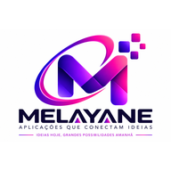

# 💼 MELAYANE

### Soluções digitais para gestão, organização e automatização de processos

**Gestão · Mobilidade · PWA · Automação**

O **MELAYANE** é um projecto de desenvolvimento de aplicações orientadas para necessidades concretas de gestão. Esta implementação está actualmente aplicada à **CASA LINO** e foi concebida com foco em simplicidade, acesso rápido e funcionamento em dispositivos móveis.

## 🎯 Objectivo

Disponibilizar uma solução prática para apoiar processos de gestão e reduzir tarefas manuais, criando uma base que possa evoluir com novas funcionalidades e diferentes contextos de utilização.

## 📱 Aplicação Web Progressiva

A estrutura do projecto inclui recursos de **PWA (Progressive Web App)**, permitindo uma experiência próxima de uma aplicação instalada:

- manifesto da aplicação;
- ícones próprios;
- execução em modo `standalone`;
- service worker;
- página para utilização em situação de indisponibilidade de rede.

## 🛠️ Tecnologias

`HTML` · `JavaScript` · `PWA` · `Service Worker`

## 🗂️ Estrutura principal

- `index.html` — interface principal;
- `manifest.json` — configuração da aplicação instalável;
- `service-worker.js` — suporte a cache e experiência PWA;
- `offline.html` — página de contingência para acesso sem ligação;
- `assets/` — recursos visuais e ícones.

## 🚧 Estado do projecto

O MELAYANE encontra-se em evolução contínua. A aplicação da CASA LINO funciona como uma implementação concreta do projecto e serve de base para aperfeiçoamento de funcionalidades e expansão futura.

## 👤 Desenvolvimento

Desenvolvido por **Nelsone David Bechane Chapananga**, com foco em soluções digitais simples, úteis e adaptadas à realidade dos utilizadores.

[← Voltar ao perfil](https://github.com/nchapananga-beep)

---

**MELAYANE — transformar necessidades de gestão em soluções digitais práticas.**

